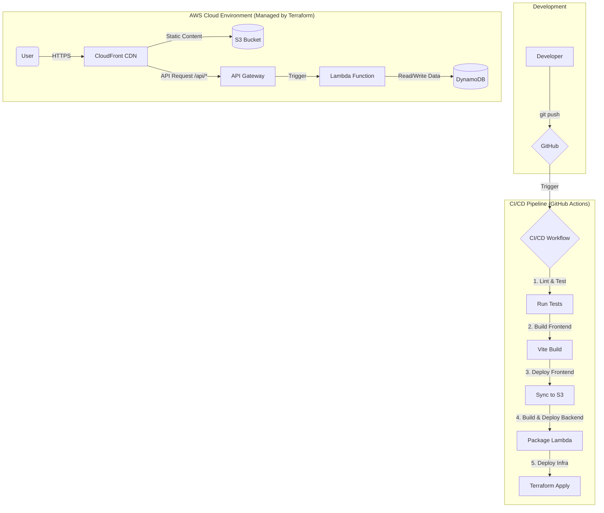

# Architecture Decision Record (ADR): Backend, Database, and Deployment

**Date**: 2025-12-06

**Status**: Proposed

## Context

The Echo Tree project, currently a frontend-only React application, needs a backend system to persist user-generated "memory cards". The goal is to build a modern, scalable, and maintainable architecture that aligns with DevOps best practices, including Infrastructure as Code (IaC) and CI/CD. The architecture should be impressive enough to be showcased in a live deployment demonstration at an all-hands meeting.

## Decision

We will adopt a **fully serverless architecture on AWS**, managed by **Terraform** for IaC, and deployed via a **GitHub Actions CI/CD pipeline**.

The chosen technology stack is:

- **Cloud Platform**: AWS
- **Frontend Deployment**: S3 (for static hosting) + CloudFront (for CDN and SSL)
- **Backend API**: API Gateway (as a RESTful endpoint) + Lambda (for serverless compute)
- **Database**: DynamoDB (as a fully-managed, scalable NoSQL database)
- **Infrastructure as Code (IaC)**: Terraform
- **CI/CD**: GitHub Actions

### Architecture Diagram

## Rationale

This stack was chosen based on the following principles, aligning with the **12-Factor App methodology**:

1.  **Codebase (I)**: A single codebase in GitHub tracks all components: frontend app, backend API, and infrastructure code.
2.  **Dependencies (II)**: Frontend (`package.json`) and backend (`package.json` in the `api/` dir) dependencies are explicitly declared and isolated.
3.  **Config (III)**: Configuration (like API endpoints, AWS regions) will be injected into the environment by the CI/CD pipeline, not hardcoded. We will use GitHub Actions Secrets and Terraform variables.
4.  **Backing Services (IV)**: All backing services (DynamoDB, S3) are treated as attached resources, managed via Terraform and referenced by URL/credentials in the config.
5.  **Build, Release, Run (V)**: The CI/CD pipeline strictly separates these stages. Building the app, creating a release (a Terraform plan + packaged code), and running it (Terraform apply) are distinct, automated steps.
6.  **Processes (VI)**: The backend API will run as one or more stateless Lambda functions. This fits the serverless model perfectly, where processes are ephemeral and share nothing.
7.  **Port Binding (VII)**: Our backend is exposed via API Gateway, which handles HTTP port binding. The Lambda function itself is not concerned with the public-facing port.
8.  **Concurrency (VIII)**: The serverless nature of Lambda allows for massive, automatic scaling of concurrent processes without manual intervention.
9.  **Disposability (IX)**: Lambda functions are inherently disposable. They start up fast and shut down gracefully. This maximizes robustness.
10. **Dev/Prod Parity (X)**: While we will start with a single environment, Terraform allows us to easily replicate the entire stack for development, staging, and production, keeping them as similar as possible.
11. **Logs (XI)**: Lambda functions automatically stream logs to CloudWatch Logs, treating them as event streams.
12. **Admin Processes (XII)**: One-off admin tasks (like database migrations, though less common in NoSQL) can be run as separate, short-lived Lambda functions or scripts.

### Benefits for Live Demonstration

- **IaC Showcase**: Demonstrates how the entire cloud infrastructure is defined as code with Terraform.
- **CI/CD Automation**: A single `git push` triggers a fully automated, visible pipeline in GitHub Actions.
- **Serverless Power**: Highlights the "zero-server management" benefit. We deploy code, not servers.
- **Speed & Agility**: The time from `push` to a globally deployed update is mere minutes, showcasing modern development velocity.

## Consequences

- **Vendor Lock-in**: This architecture is tightly coupled with AWS services. While Terraform is cloud-agnostic, the specific resource definitions (`aws_lambda_function`, `aws_dynamodb_table`) are AWS-specific. This is an accepted trade-off for the speed and integration benefits.
- **Learning Curve**: Team members unfamiliar with AWS, Terraform, or serverless concepts will require training.
- **Local Development**: Replicating the cloud environment locally can be challenging. We will rely on unit tests and potentially tools like `serverless-offline` or AWS SAM for local simulation.
- **Initial Setup Cost**: There is an upfront time investment in setting up the Terraform scripts and CI/CD pipeline correctly. However, this pays dividends in long-term stability and speed.
