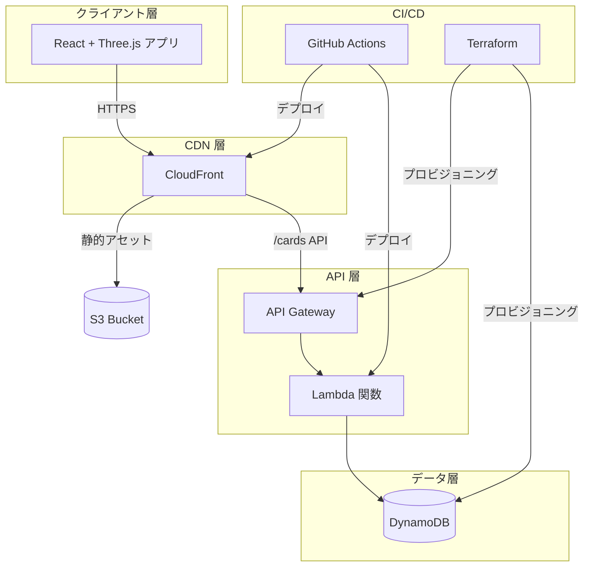

<div align="center">

# ✨ Echo Tree

### チームの思い出を星空に輝く星座へ

[](https://opensource.org/licenses/MIT)
[](https://github.com/erictung1999/echo-tree/stargazers)
[](https://github.com/erictung1999/echo-tree/network/members)
[](https://github.com/erictung1999/echo-tree/issues)

[English](README.md) · [繁體中文](README.zh-tw.md) · **[日本語](README.ja.md)**

<br />


<br />

*没入型 3D 体験で、すべての思い出がチームの宇宙で輝く星になります。*

<br />

[機能](#-機能) · [クイックスタート](#-クイックスタート) · [アーキテクチャ](#%EF%B8%8F-アーキテクチャ) · [デプロイ](#-デプロイ) · [コントリビュート](#-コントリビュート)

</div>

---

## 🎯 Echo Tree とは？

Echo Tree は**インタラクティブな 3D メモリーコレクションアプリ**です。チームメンバーは仮想の星空で思い出カードを作成、共有、探索できます。活用シーン：

- 🎤 **オールハンズミーティング** — チームの感謝やハイライトをリアルタイムで収集
- 🎉 **お祝い・マイルストーン** — 誕生日の祝福、記念日の思い出を収集
- 📅 **年末振り返り** — 一年の成果を一緒に可視化
- 🏆 **ハッカソン・イベント** — QR コードで共有メモリースペースを作成

体験だけでなく、Echo Tree は**モダンなクラウドアーキテクチャのショーケース**でもあり、サーバーレス開発、Infrastructure as Code、CI/CD 自動化のベストプラクティスを実演しています。

---

## ⭐ 機能

### 🌌 3D インタラクティブ星空

思い出の宇宙を自由に飛び回り、滑らかな 3D ビジュアル体験を楽しめます。**Three.js** と **React Three Fiber** で構築され、**InstancedMesh** 技術により数百枚のカードを1回の描画コールで効率的にレンダリングします。

### ✍️ AI カラー提案付きメモリーカード

美しいメモリーカードを作成し、オプションで**AI 感情分析**を有効にすると、テキストの内容に基づいて自動的に色を推薦します。**Lumina Spark** モデルを採用し、`transformers.js` によりブラウザ上で完全に実行、Web Worker でメインスレッドをブロックしません。

### 🎬 シネマティック AutoPilot ナビゲーション

ハリウッド級のカメラワークを体験：
- **ドリーズーム** — 各思い出に引き込まれるフォーカスエフェクト
- **スピードランピング** — ドラマチックな緩急のある動き
- **クレーン & オービットショット** — プロの撮影技法
- **スマートカード選択** — 重複を避ける重み付けアルゴリズム

### 📺 プレゼンテーションモード

イベント会場の大画面表示に最適：
- **自動ローテーション** — 9秒間隔で切り替え、進捗インジケーター付き
- **マルチカードフローモード** — カードが優雅にフェードイン・アウト
- **QR コード統合** — 参加者がスキャンして即座に思い出を追加
- **キーボードショートカット** — ← → でナビゲート、Space/P で一時停止、ESC で終了

### 📱 クロスデバイス体験

あらゆるデバイスで美しく動作：
- **ジャイロスコープ制御** — スマホを傾けて星空をナビゲート
- **触覚フィードバック** — インタラクション時に微細な振動
- **マウスパララックス** — デスクトップでカーソル追従の微細な動き
- **`prefers-reduced-motion` 対応** — アクセシビリティファーストなデザイン

### 🎄 隠しイースターエッグ

**コナミコマンド**（↑↑↓↓←→←→BA）を入力して魔法のクリスマスサプライズを解除：
- ❄️ リアルな物理演算の雪
- 🌲 装飾された 3D クリスマスツリー
- 🔥 温かみのあるアニメーション暖炉
- 🌌 空に浮かぶオーロラ
- 🍪 踊るジンジャーブレッドマン群

---

## 🚀 クイックスタート

### ローカルで試す（フロントエンドのみ）

30秒で 3D 星空を体験：

```bash
git clone https://github.com/erictung1999/echo-tree.git
cd echo-tree/app
npm install
npm run dev
```

[http://localhost:5173](http://localhost:5173) を開いて思い出を作成しましょう！

> 💡 **注意**：バックエンドなしでは、カードは localStorage のみに保存されます。クラウドへの永続保存は[デプロイ](#-デプロイ)を参照してください。

### フルスタック開発

完全なバックエンド付きで実行：

```bash
# 1. フロントエンドのセットアップ
cd app
cp .env.example .env
# .env を編集して API エンドポイントを設定
npm install
npm run dev

# 2. バックエンドのデプロイ（AWS CLI と Terraform が必要）
cd ../terraform
terraform init
terraform apply
```

---

## 🏛️ アーキテクチャ

Echo Tree は **[12-Factor App](https://12factor.net/)** 方法論に従い、**Serverless-first** アプローチを採用しています。

### システム概要



### 技術スタック

<table>
<tr>
<td valign="top" width="33%">

#### フロントエンド


- **React Three Fiber** 宣言的 3D
- **Drei** Three.js ヘルパー
- **Transformers.js** ブラウザサイド AI

</td>
<td valign="top" width="33%">

#### バックエンド


- **Express.js** + serverless-http
- **UUID** カード識別子
- **GSI** イベントベースクエリ

</td>
<td valign="top" width="33%">

#### インフラストラクチャ


- **S3** 静的ホスティング
- **OIDC** セキュアな AWS 認証
- **IaC** — コンソール操作不要！

</td>
</tr>
</table>

### 主要な設計判断

| 判断 | 理由 |
|------|------|
| **InstancedMesh でカードをレンダリング** | 1回の描画コールで 100+ 枚のカードをレンダリングし、60fps を維持 |
| **Web Worker で AI 実行** | ノンブロッキングな感情分析で UI の応答性を確保 |
| **DynamoDB GSI** | `eventCode` による効率的なグループ/イベントフィルタリング |
| **環境変数駆動の設定** | ハードコードされた URL なし、dev/staging/prod で共通利用可能 |
| **OIDC で CI/CD 認証** | GitHub Secrets に長期間有効な AWS 認証情報不要 |

> 📖 詳細なアーキテクチャ決定については [ADR.md](ADR.md) を参照

---

## 🚢 デプロイ

### 前提条件

- 適切な権限を持つ AWS アカウント
- Terraform >= 1.5.0
- Node.js >= 22
- GitHub リポジトリ（CI/CD 用）

### ステップ 1: インフラストラクチャのセットアップ

```bash
cd terraform
terraform init
terraform apply
```

出力値を保存してください — `api_gateway_invoke_url`、`s3_bucket_name`、`cloudfront_distribution_id` が必要です。

### ステップ 2: GitHub Secrets の設定

リポジトリ設定で以下の Secrets を追加：

| Secret | 値 |
|--------|------|
| `AWS_IAM_ROLE_ARN` | OIDC ロール ARN |
| `S3_BUCKET_NAME` | Terraform 出力値 |
| `CLOUDFRONT_DISTRIBUTION_ID` | Terraform 出力値 |

### ステップ 3: フロントエンドの設定

```bash
cd app
cp .env.example .env
# .env を編集し、Terraform 出力の VITE_API_BASE_URL を設定
```

### ステップ 4: デプロイ

```bash
git add .
git commit -m "Configure deployment"
git push origin main
```

GitHub Actions が自動的に：
1. ✅ React アプリをビルド
2. ✅ S3 に同期
3. ✅ Lambda 関数をデプロイ
4. ✅ CloudFront キャッシュを無効化

アプリが公開されました！🎉

---

## 🗺️ ロードマップ

- [ ] **WebSocket リアルタイム同期** — 新しいカードが即座に表示
- [ ] **多言語 UI** — ドキュメントだけでなくインターフェースも多言語対応
- [ ] **より多くのイースターエッグ** — 季節テーマ（ハロウィン、新年）
- [ ] **カードリアクション** — 閲覧者が思い出に ❤️ を送信
- [ ] **エクスポート機能** — 星空を動画としてダウンロード

---

## 🤝 コントリビュート

あらゆる貢献を歓迎します！

- 🐛 バグ修正
- ✨ 新機能
- 📝 ドキュメント改善
- 🎨 UI/UX 強化

### 始め方

1. リポジトリをフォーク
2. 機能ブランチを作成（`git checkout -b feature/amazing-feature`）
3. 変更をコミット（`git commit -m 'Add amazing feature'`）
4. ブランチをプッシュ（`git push origin feature/amazing-feature`）
5. プルリクエストを開く

---

## 📄 ライセンス

このプロジェクトは MIT ライセンスの下で公開されています — 詳細は [LICENSE](LICENSE) ファイルを参照してください。

---

<div align="center">

### ⭐ Echo Tree が役に立ったら、ぜひスターをお願いします！

より多くの人がこのプロジェクトを発見でき、私たちの改善のモチベーションになります。

<br />

**Echo Tree チームが ❤️ を込めて作成**

</div>
