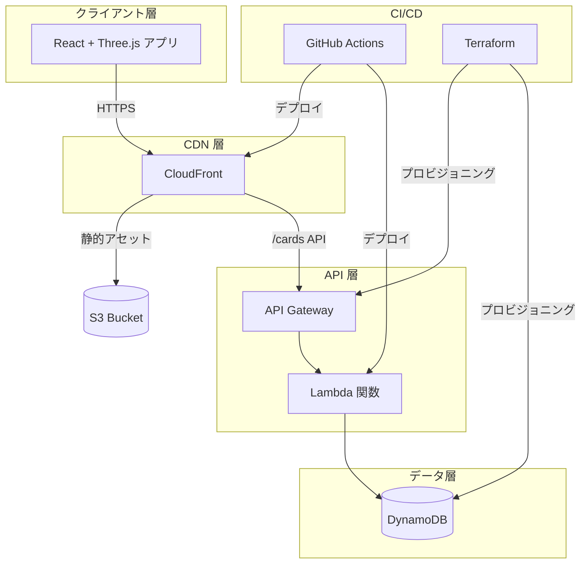

<div align="center">

# ✨ Echo Tree

### チームの思い出を星空に輝く星座へ

[](https://opensource.org/licenses/MIT)
[](https://github.com/ceparadise168/echo-tree/stargazers)
[](https://github.com/ceparadise168/echo-tree/network/members)
[](https://github.com/ceparadise168/echo-tree/issues)

[English](README.md) · [繁體中文](README.zh-tw.md) · **[日本語](README.ja.md)**

<br />


<br />

*没入型 3D 体験で、すべての思い出がチームの宇宙で輝く星になります。*

<br />

[機能](#-機能) · [クイックスタート](#-クイックスタート) · [アーキテクチャ](#%EF%B8%8F-アーキテクチャ) · [デプロイ](#-デプロイ) · [コントリビュート](#-コントリビュート)

</div>

---

## 🎯 Echo Tree とは？

Echo Tree は**インタラクティブな 3D メモリーコレクションアプリ**です。チームメンバーは仮想の星空で思い出カードを作成、共有、探索できます。活用シーン：

- 🎤 **オールハンズミーティング** — チームの感謝やハイライトをリアルタイムで収集
- 🎉 **お祝い・マイルストーン** — 誕生日の祝福、記念日の思い出を収集
- 📅 **年末振り返り** — 一年の成果を一緒に可視化
- 🏆 **ハッカソン・イベント** — QR コードで共有メモリースペースを作成

体験だけでなく、Echo Tree は**モダンなクラウドアーキテクチャのショーケース**でもあり、サーバーレス開発、Infrastructure as Code、CI/CD 自動化のベストプラクティスを実演しています。

---

## ⭐ 機能

### 🌌 3D インタラクティブ星空

思い出の宇宙を自由に飛び回り、滑らかな 3D ビジュアル体験を楽しめます。**Three.js** と **React Three Fiber** で構築され、**InstancedMesh** 技術により数百枚のカードを1回の描画コールで効率的にレンダリングします。

### ✍️ AI カラー提案付きメモリーカード

美しいメモリーカードを作成し、オプションで**AI 感情分析**を有効にすると、テキストの内容に基づいて自動的に色を推薦します。**Lumina Spark** モデルを採用し、`transformers.js` によりブラウザ上で完全に実行、Web Worker でメインスレッドをブロックしません。

### 🎬 シネマティック AutoPilot ナビゲーション

ハリウッド級のカメラワークを体験：
- **ドリーズーム** — 各思い出に引き込まれるフォーカスエフェクト
- **スピードランピング** — ドラマチックな緩急のある動き
- **クレーン & オービットショット** — プロの撮影技法
- **スマートカード選択** — 重複を避ける重み付けアルゴリズム

### 📺 プレゼンテーションモード

イベント会場の大画面表示に最適：
- **自動ローテーション** — 9秒間隔で切り替え、進捗インジケーター付き
- **マルチカードフローモード** — カードが優雅にフェードイン・アウト
- **QR コード統合** — 参加者がスキャンして即座に思い出を追加
- **キーボードショートカット** — ← → でナビゲート、Space/P で一時停止、ESC で終了

### 📱 クロスデバイス体験

あらゆるデバイスで美しく動作：
- **ジャイロスコープ制御** — スマホを傾けて星空をナビゲート
- **触覚フィードバック** — インタラクション時に微細な振動
- **マウスパララックス** — デスクトップでカーソル追従の微細な動き
- **`prefers-reduced-motion` 対応** — アクセシビリティファーストなデザイン

### 🎄 隠しイースターエッグ

**コナミコマンド**（↑↑↓↓←→←→BA）を入力して魔法のクリスマスサプライズを解除：
- ❄️ リアルな物理演算の雪
- 🌲 装飾された 3D クリスマスツリー
- 🔥 温かみのあるアニメーション暖炉
- 🌌 空に浮かぶオーロラ
- 🍪 踊るジンジャーブレッドマン群

---

## 🚀 クイックスタート

### ローカルで試す（フロントエンドのみ）

30秒で 3D 星空を体験：

```bash
git clone https://github.com/ceparadise168/echo-tree.git
cd echo-tree/app
npm install
npm run dev
```

[http://localhost:5173](http://localhost:5173) を開いて思い出を作成しましょう！

> 💡 **注意**：バックエンドなしでは、カードは localStorage のみに保存されます。クラウドへの永続保存は[デプロイ](#-デプロイ)を参照してください。

### フルスタック開発

完全なバックエンド付きで実行：

```bash
# 1. フロントエンドのセットアップ
cd app
cp .env.example .env
# .env を編集して API エンドポイントを設定
npm install
npm run dev

# 2. バックエンドのデプロイ（AWS CLI と Terraform が必要）
cd ../terraform
terraform init
terraform apply
```

---

## 🏛️ アーキテクチャ

Echo Tree は **[12-Factor App](https://12factor.net/)** 方法論に従い、**Serverless-first** アプローチを採用しています。

### システム概要



### 技術スタック

<table>
<tr>
<td valign="top" width="33%">

#### フロントエンド


- **React Three Fiber** 宣言的 3D
- **Drei** Three.js ヘルパー
- **Transformers.js** ブラウザサイド AI

</td>
<td valign="top" width="33%">

#### バックエンド


- **Express.js** + serverless-http
- **UUID** カード識別子
- **GSI** イベントベースクエリ

</td>
<td valign="top" width="33%">

#### インフラストラクチャ


- **S3** 静的ホスティング
- **OIDC** セキュアな AWS 認証
- **IaC** — コンソール操作不要！

</td>
</tr>
</table>

### 主要な設計判断

| 判断 | 理由 |
|------|------|
| **InstancedMesh でカードをレンダリング** | 1回の描画コールで 100+ 枚のカードをレンダリングし、60fps を維持 |
| **Web Worker で AI 実行** | ノンブロッキングな感情分析で UI の応答性を確保 |
| **DynamoDB GSI** | `eventCode` による効率的なグループ/イベントフィルタリング |
| **環境変数駆動の設定** | ハードコードされた URL なし、dev/staging/prod で共通利用可能 |
| **OIDC で CI/CD 認証** | GitHub Secrets に長期間有効な AWS 認証情報不要 |

> 📖 詳細なアーキテクチャ決定については [ADR.md](ADR.md) を参照

---

## 🚢 デプロイ

このガイドでは、AWS のセットアップ、GitHub Actions の設定、本番環境へのデプロイまで、Echo Tree をゼロからデプロイする方法を説明します。

### 前提条件

- 適切な権限を持つ AWS アカウント
- Terraform >= 1.5.0
- Node.js >= 22
- [AWS CLI](https://docs.aws.amazon.com/cli/latest/userguide/getting-started-install.html) のインストールと設定
- GitHub リポジトリ（このプロジェクトをフォーク）

---

### フェーズ 1: ローカル環境と初期インフラストラクチャ

#### Step 1.1: リポジトリのクローン

```bash
git clone https://github.com/YOUR_USERNAME/echo-tree.git
cd echo-tree
```

#### Step 1.2: AWS CLI の設定

1. [AWS コンソール](https://console.aws.amazon.com/) にログインし、**IAM** に移動します。
2. 新しいユーザー（例: `echo-tree-local-admin`）を作成し、`AdministratorAccess` ポリシーを付与します。
3. ユーザーの **Security credentials** タブでアクセスキーを作成します。
4. `Access key ID` と `Secret access key` をすぐに保存します。
5. ターミナルで実行：
   ```bash
   aws configure
   ```
   アクセスキー、シークレットキー、デフォルトリージョン（例: `us-east-1`）を入力します。

#### Step 1.3: Terraform でインフラをデプロイ

```bash
cd terraform
terraform init
terraform apply
```

`yes` で確認後、リソースが作成されるのを待ちます。**出力値を保存**：
- `cloudfront_domain_name`
- `s3_bucket_name`
- `api_gateway_invoke_url`
- `cloudfront_distribution_id`

---

### フェーズ 2: GitHub Actions と AWS の連携（OIDC）

このセットアップでは、GitHub Actions と AWS 間でセキュアなキーレス認証を行う OpenID Connect (OIDC) を使用します。

#### Step 2.1: AWS で OIDC Identity Provider を作成

1. IAM で **Identity providers** → **Add provider** に移動します。
2. `OpenID Connect` を選択します。
3. 以下を入力：
   - **Provider URL**: `https://token.actions.githubusercontent.com`
   - **Audience**: `sts.amazonaws.com`
4. **Add provider** をクリックします。

#### Step 2.2: GitHub Actions 用 IAM ロールを作成

1. IAM で **Roles** → **Create role** に移動します。
2. 信頼されたエンティティタイプとして **Web identity** を選択します。
3. 作成した `token.actions.githubusercontent.com` プロバイダーを選択します。
4. **Audience** で `sts.amazonaws.com` を選択します。
5. GitHub アクセスを設定：
   - **Organization**: GitHub ユーザー名
   - **Repository**: `echo-tree`
   - **Branch**（推奨）: `main`
6. **Next** をクリックします。
7. `AdministratorAccess` ポリシーをアタッチ（またはより制限的なカスタムポリシーを作成）。
8. ロール名（例: `github-actions-echo-tree-role`）を付けて作成します。
9. **Role ARN をコピー** — `arn:aws:iam::123456789012:role/github-actions-echo-tree-role` のような形式です。

#### Step 2.3: GitHub Secrets の設定

GitHub リポジトリで **Settings → Secrets and variables → Actions** に移動し、以下を追加：

| Secret | 値 |
|--------|------|
| `AWS_IAM_ROLE_ARN` | Step 2.2 の Role ARN |
| `S3_BUCKET_NAME` | Terraform 出力値 |
| `CLOUDFRONT_DISTRIBUTION_ID` | Terraform 出力値 |

---

### フェーズ 3: フロントエンドを接続して本番環境へ

#### Step 3.1: フロントエンド環境の設定

```bash
cd app
cp .env.example .env
```

`.env` を編集し、API ベース URL を設定（末尾のスラッシュや `/cards` は不要）：
```
VITE_API_BASE_URL=https://xxxxx.execute-api.us-east-1.amazonaws.com/v1
```

React アプリがこの URL に自動的に `/cards` を追加します。

#### Step 3.2: ローカルでテスト

```bash
npm install
npm run dev
```

接続が正常に動作することを確認し、`Ctrl+C` で停止します。

#### Step 3.3: デプロイ

```bash
cd ..
git add .
git commit -m "feat: configure deployment"
git push origin main
```

#### Step 3.4: 魔法を見守る

GitHub の **Actions** タブに移動します。ワークフローが：
1. ✅ React アプリをビルド
2. ✅ 静的ファイルを S3 に同期
3. ✅ Lambda 関数をパッケージしてデプロイ
4. ✅ `terraform apply` でインフラを同期
5. ✅ CloudFront キャッシュを無効化

完了後（緑のチェックマーク）、`cloudfront_domain_name` URL を開く — **アプリが本番稼働中！** 🎉

---

### その後のデプロイ

初期セットアップ後は、`git push origin main` を行うたびに自動的に：
- フロントエンドの変更をビルドしてデプロイ
- Lambda コードを更新（変更がある場合）
- インフラを同期

手動ステップは不要です！

---

## 🗺️ ロードマップ

- [ ] **WebSocket リアルタイム同期** — 新しいカードが即座に表示
- [ ] **多言語 UI** — ドキュメントだけでなくインターフェースも多言語対応
- [ ] **より多くのイースターエッグ** — 季節テーマ（ハロウィン、新年）
- [ ] **カードリアクション** — 閲覧者が思い出に ❤️ を送信
- [ ] **エクスポート機能** — 星空を動画としてダウンロード

---

## 🤝 コントリビュート

あらゆる貢献を歓迎します！

- 🐛 バグ修正
- ✨ 新機能
- 📝 ドキュメント改善
- 🎨 UI/UX 強化

### 始め方

1. リポジトリをフォーク
2. 機能ブランチを作成（`git checkout -b feature/amazing-feature`）
3. 変更をコミット（`git commit -m 'Add amazing feature'`）
4. ブランチをプッシュ（`git push origin feature/amazing-feature`）
5. プルリクエストを開く

---

## 📄 ライセンス

このプロジェクトは MIT ライセンスの下で公開されています — 詳細は [LICENSE](LICENSE) ファイルを参照してください。

---

<div align="center">

### ⭐ Echo Tree が役に立ったら、ぜひスターをお願いします！

より多くの人がこのプロジェクトを発見でき、私たちの改善のモチベーションになります。

<br />

**Echo Tree チームが ❤️ を込めて作成**

</div>
