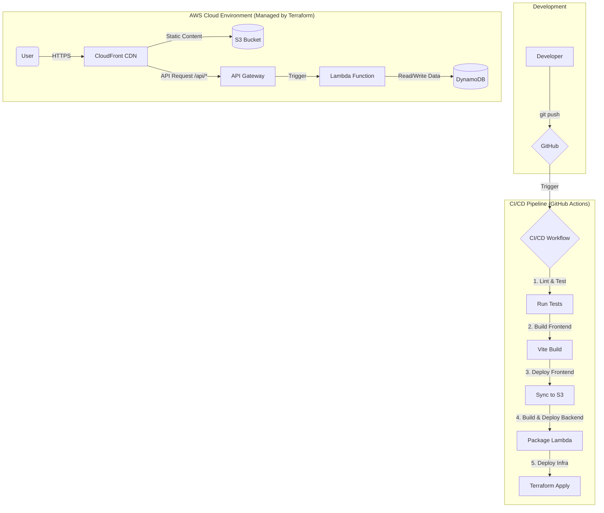

# Echo Tree: モダンなクラウドアプリケーションショーケース

Echo Tree へようこそ！このプロジェクトは 3D 体験にとどまらず、最新のクラウドアーキテクチャ、DevOps、そして自動化されたデプロイメントを一体となって実演するデモです。本ドキュメントではアーキテクチャの全体像を説明し、ステップバイステップでデプロイ方法を解説します。

## 🏛️ アーキテクチャ概要

本プロジェクトは **12-Factor App** の原則に基づき、**Serverless-First** の思想で AWS 上に構築されています。すべてのインフラは Terraform によってコード化され、GitHub Actions を用いて自動的にデプロイされます。

### キーコンセプト
- **Infrastructure as Code**：データベースや API、CDN などのリソースはすべて Terraform で定義し、AWS コンソールでの手作業をなくします。
- **CI/CD オートメーション**：`git push main` を行うたびに、自動的にビルド・テスト・デプロイが実行されます。
- **サーバーレスコンピューティング**：バックエンドは AWS Lambda を使用し、サーバー管理不要で自動スケールします。
- **高スケーラビリティ & 低コスト**：トラフィックが少ないときはほぼコストが発生しない従量課金モデルです。

### 技術スタック

| 領域 | 技術 | 役割 |
| :--- | :--- | :--- |
| クラウド基盤 | AWS | すべてのサービスをホストするプラットフォーム |
| フロントエンド | React, Three.js, Vite | 没入型 3D 体験を提供 |
| フロントエンド配信 | S3 + CloudFront | グローバル CDN、HTTPS サポート |
| バックエンド API | API Gateway + Lambda | サーバーレスの REST API |
| データベース | DynamoDB | 高パフォーマンスな NoSQL、Lambda と高い親和性 |
| IaC | Terraform | すべてのリソースをコードで記述 |
| CI/CD | GitHub Actions | 自動ビルド・テスト・デプロイ |

### アーキテクチャ図



---

## 🚀 デプロイメントガイド（初心者向けステップ別）

以下の手順は経験 0〜2 年程度のジュニアエンジニアでも実践できるよう、可能な限り細かく説明しています。

### フェーズ 1: ローカル環境の準備と手動デプロイ

#### Step 1.1 リポジトリの取得
1. GitHub で本プロジェクトを **Fork** します。
2. ターミナルで以下を実行し、フォークしたリポジトリをクローンします。
   ```bash
   git clone https://github.com/YOUR_USERNAME/echo-tree.git
   cd echo-tree
   ```

#### Step 1.2 必須ツールのインストール
以下をインストールしてください：
- [Git](https://git-scm.com/book/en/v2/Getting-Started-Installing-Git)
- [Node.js v18 以上](https://nodejs.org/en/download/)
- [Terraform CLI v1.5+](https://learn.hashicorp.com/tutorials/terraform/install-cli)
- [AWS CLI](https://docs.aws.amazon.com/cli/latest/userguide/getting-started-install.html)

#### Step 1.3 AWS 認証情報の設定
1. [AWS コンソール](https://aws.amazon.com/console/) にログインし、IAM サービスを開きます。
2. ユーザーを作成（例: `echo-tree-local-admin`）、ポリシー `AdministratorAccess` を付与します。
3. ユーザー詳細ページの **Security credentials** タブでアクセスキーを作成し、`Access key ID` と `Secret access key` を保存します。
4. ターミナルで以下を実行し、AWS CLI に認証情報を設定します：
   ```bash
   aws configure
   ```
   プロンプトに従ってアクセスキー、リージョン（例: `us-east-1`）などを入力します。

#### Step 1.4 Terraform で初期デプロイ
1. Terraform ディレクトリに移動：
   ```bash
   cd terraform
   ```
2. 初期化（プロバイダーのダウンロード）：
   ```bash
   terraform init
   ```
3. デプロイ（プラン確認後に `yes` と入力）：
   ```bash
   terraform apply
   ```
4. 数分待つと AWS リソースが作成され、最後に `Outputs` が表示されます。
   **ここで `cloudfront_domain_name` や `s3_bucket_name`、`api_gateway_invoke_url` を控えてください。**

---

### フェーズ 2: GitHub Actions と AWS の連携（OIDC）

#### Step 2.1 OIDC プロバイダーの登録
1. IAM サービスで左メニューの **Identity providers** → **Add provider** を開きます。
2. `OpenID Connect` を選択し、以下を入力：
   - Provider URL: `https://token.actions.githubusercontent.com`
   - Audience: `sts.amazonaws.com`

#### Step 2.2 GitHub Actions 用 IAM ロール
1. IAM → **Roles** → **Create role**。
2. Trusted entity として `Web identity` を選び、先ほどの OIDC プロバイダーを指定します。
3. Audience に `sts.amazonaws.com` を選択。
4. GitHub リポジトリ（例: `YOUR_USERNAME/echo-tree`）とブランチ `main` を設定。
5. 権限 `AdministratorAccess` を付与し、`github-actions-echo-tree-role` などの名前で作成。
6. 作成後、ロール詳細画面で **Role ARN** をコピーします。

#### Step 2.3 GitHub シークレットの設定
1. GitHub リポジトリ → **Settings → Secrets and variables → Actions**。
2. 以下のシークレットを追加：
   - `AWS_IAM_ROLE_ARN`: ロール ARN。
   - `S3_BUCKET_NAME`: Terraform 出力の S3 バケット名。
   - `CLOUDFRONT_DISTRIBUTION_ID`: CloudFront のディストリビューション ID。

---

### フェーズ 3: フロントエンドを API に接続し、本番環境へ

#### Step 3.1 フロントエンド環境の設定
1. フロントエンド用フォルダーへ移動します。
   ```bash
   cd app
   ```
2. サンプル環境変数ファイルを複製し、ローカルの `.env` を作成します。
   ```bash
   cp .env.example .env
   ```
3. `.env` を開き、Terraform の出力で得た API Gateway のベース URL（末尾のスラッシュや `/cards` は不要）を設定します。
   ```
   VITE_API_BASE_URL=https://xxxxx.execute-api.us-east-1.amazonaws.com/v1
   ```
   React アプリ側で `/cards` などのパスを自動的に付与するため、`App.jsx` を直接編集する必要はありません。
4. `.env` は既に `.gitignore` に含まれているのでコミットしないでください。チームで設定方法を共有したい場合は `app/.env.example` を参照してもらいましょう。

#### Step 3.2 ローカル検証とプッシュ
1. `app` ディレクトリのまま依存パッケージをインストールし、ローカルで接続確認を行います。
   ```bash
   npm install
   npm run dev
   ```
   テストが終わったら `Ctrl+C` で停止し、リポジトリルートへ戻ります。
   ```bash
   cd ..
   ```
2. 今回の変更（README の更新や機能追加など）をコミットし、`main` ブランチへプッシュしてワークフローを走らせます。
   ```bash
   git add .
   git commit -m "feat: env で API を接続"
   git push origin main
   ```
3. GitHub の **Actions** タブで進行中のワークフローを開きます。
   - フロントエンドをビルドし、S3 へデプロイ。
   - Lambda 用の API をパッケージして更新。
   - `terraform apply` を実行してインフラの差分を反映。
   - CloudFront キャッシュを無効化し、最新バージョンを即時配信。
4. 成功（緑のチェック）を確認したら、`cloudfront_domain_name` をブラウザで開き、カードが API から取得されていることをチェックしてください。

**これで Echo Tree が本番環境で稼働を開始しました！** 以降は `main` ブランチへ push するたびに、自動デプロイが行われます。

---

お疲れさまでした。これでサーバーレス + IaC + CI/CD をフル活用した最新アーキテクチャを実装できました。オールハンズ・ミーティングでのライブデモも安心して臨んでください！
