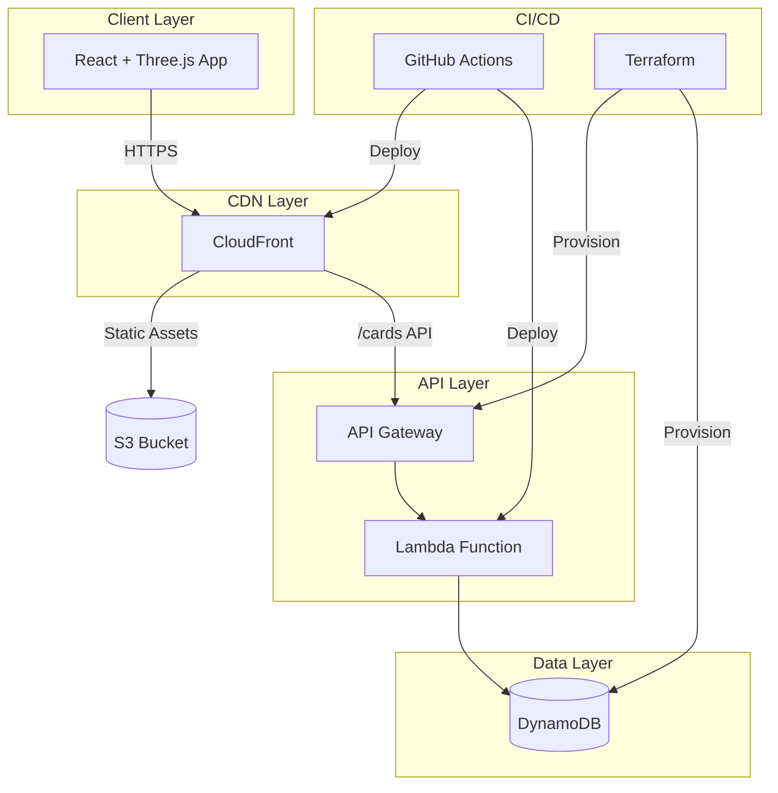

<div align="center">

# ✨ Echo Tree

### Transform team memories into a constellation of stars

[](https://opensource.org/licenses/MIT)
[](https://github.com/erictung1999/echo-tree/stargazers)
[](https://github.com/erictung1999/echo-tree/network/members)
[](https://github.com/erictung1999/echo-tree/issues)

**[English](README.md)** · [繁體中文](README.zh-tw.md) · [日本語](README.ja.md)

<br />


<br />

*An immersive 3D experience where every memory becomes a glowing star in your team's universe.*

<br />

[Features](#-features) · [Quick Start](#-quick-start) · [Architecture](#%EF%B8%8F-architecture) · [Deployment](#-deployment) · [Contributing](#-contributing)

</div>

---

## 🎯 What is Echo Tree?

Echo Tree is an **interactive 3D memory collection app** where teams can create, share, and explore memories as glowing cards floating in a virtual starfield. Perfect for:

- 🎤 **All-Hands Meetings** — Collect team kudos and highlights in real-time
- 🎉 **Celebrations & Milestones** — Capture birthday wishes, anniversary memories
- 📅 **Year-End Reviews** — Visualize a year of achievements together
- 🏆 **Hackathons & Events** — Create shared memory spaces with QR code access

Beyond the experience, Echo Tree serves as a **modern cloud architecture showcase**, demonstrating best practices in serverless development, Infrastructure as Code, and CI/CD automation.

---

## ⭐ Features

### 🌌 3D Interactive Starfield

Fly through a universe of memories with smooth, performant 3D graphics. Built with **Three.js** and **React Three Fiber**, using **InstancedMesh** for efficient rendering of hundreds of cards in a single draw call.

### ✍️ Memory Cards with AI Color Suggestions

Create beautiful memory cards with an optional **AI-powered color recommendation** based on the emotion in your text. Powered by the **Lumina Spark** model using `transformers.js`, running entirely in-browser via Web Workers.

### 🎬 Cinematic AutoPilot Navigation

Experience Hollywood-style camera movements with our AutoPilot mode:
- **Dolly Zoom** — Focus effect that draws you into each memory
- **Speed Ramping** — Dynamic slow-fast-slow transitions for dramatic effect  
- **Crane & Orbit Shots** — Professional cinematography techniques
- **Smart Card Selection** — Weighted algorithm avoids repetition

### 📺 Presentation Mode

Perfect for displaying on large screens during events:
- **Auto-rotation** with 9-second intervals and progress indicator
- **Multi-card flow mode** — Cards fade in and out beautifully
- **QR Code integration** — Attendees scan to add their memories live
- **Keyboard shortcuts** — ← → navigate, Space/P pause, ESC exit

### 📱 Cross-Device Experience

Works beautifully everywhere:
- **Gyroscope control** on mobile — Tilt your phone to navigate the starfield
- **Haptic feedback** — Feel gentle vibrations on interactions
- **Mouse parallax** on desktop — Subtle movement follows your cursor
- **Respects `prefers-reduced-motion`** — Accessibility-first design

### 🎄 Hidden Easter Egg

Enter the **Konami Code** (↑↑↓↓←→←→BA) to unlock a magical Christmas surprise:
- ❄️ Snowfall with realistic physics
- 🌲 Decorated 3D Christmas tree
- 🔥 Cozy animated fireplace
- 🌌 Aurora borealis in the sky
- 🍪 Dancing gingerbread crowd

---

## 🚀 Quick Start

### Try Locally (Frontend Only)

Experience the 3D starfield in under 30 seconds:

```bash
git clone https://github.com/erictung1999/echo-tree.git
cd echo-tree/app
npm install
npm run dev
```

Open [http://localhost:5173](http://localhost:5173) and start creating memories!

> 💡 **Note**: Without a backend, cards are stored in localStorage only. For full functionality with cloud persistence, see [Deployment](#-deployment).

### Full Stack Development

To run with the complete backend:

```bash
# 1. Set up frontend
cd app
cp .env.example .env
# Edit .env with your API endpoint
npm install
npm run dev

# 2. Deploy backend (requires AWS CLI & Terraform)
cd ../terraform
terraform init
terraform apply
```

---

## 🏛️ Architecture

Echo Tree follows the **[12-Factor App](https://12factor.net/)** methodology with a **Serverless-first** approach.

### System Overview



### Tech Stack

<table>
<tr>
<td valign="top" width="33%">

#### Frontend


- **React Three Fiber** for declarative 3D
- **Drei** for Three.js helpers
- **Transformers.js** for client-side AI

</td>
<td valign="top" width="33%">

#### Backend


- **Express.js** wrapped with serverless-http
- **UUID** for card IDs
- **GSI** for event-based queries

</td>
<td valign="top" width="33%">

#### Infrastructure


- **S3** for static hosting
- **OIDC** for secure AWS auth
- **IaC** — No console clicking!

</td>
</tr>
</table>

### Key Design Decisions

| Decision | Rationale |
|----------|-----------|
| **InstancedMesh for cards** | Render 100+ cards with a single draw call for 60fps performance |
| **Web Worker for AI** | Non-blocking sentiment analysis keeps UI responsive |
| **DynamoDB GSI** | Efficient queries by `eventCode` for group/event filtering |
| **Environment-driven config** | Zero hardcoded URLs; works across dev/staging/prod |
| **OIDC for CI/CD** | No long-lived AWS credentials in GitHub secrets |

> 📖 For detailed architecture decisions, see [ADR.md](ADR.md)

---

## 🚢 Deployment

### Prerequisites

- AWS Account with appropriate permissions
- Terraform >= 1.5.0
- Node.js >= 22
- GitHub repository (for CI/CD)

### Step 1: Infrastructure Setup

```bash
cd terraform
terraform init
terraform apply
```

Save the outputs — you'll need `api_gateway_invoke_url`, `s3_bucket_name`, and `cloudfront_distribution_id`.

### Step 2: Configure GitHub Secrets

In your repo settings, add these secrets:

| Secret | Value |
|--------|-------|
| `AWS_IAM_ROLE_ARN` | Your OIDC role ARN |
| `S3_BUCKET_NAME` | From Terraform output |
| `CLOUDFRONT_DISTRIBUTION_ID` | From Terraform output |

### Step 3: Configure Frontend

```bash
cd app
cp .env.example .env
# Edit .env with VITE_API_BASE_URL from Terraform output
```

### Step 4: Deploy

```bash
git add .
git commit -m "Configure deployment"
git push origin main
```

GitHub Actions will automatically:
1. ✅ Build the React app
2. ✅ Sync to S3
3. ✅ Deploy Lambda function
4. ✅ Invalidate CloudFront cache

Your app is live! 🎉

---

## 🗺️ Roadmap

- [ ] **WebSocket real-time sync** — See new cards appear instantly
- [ ] **Multi-language UI** — i18n support beyond just docs
- [ ] **More Easter eggs** — Seasonal themes (Halloween, New Year)
- [ ] **Card reactions** — Let viewers send ❤️ to memories
- [ ] **Export feature** — Download your starfield as a video

---

## 🤝 Contributing

We welcome contributions! Whether it's:

- 🐛 Bug fixes
- ✨ New features
- 📝 Documentation improvements
- 🎨 UI/UX enhancements

### Getting Started

1. Fork the repository
2. Create a feature branch (`git checkout -b feature/amazing-feature`)
3. Commit your changes (`git commit -m 'Add amazing feature'`)
4. Push to the branch (`git push origin feature/amazing-feature`)
5. Open a Pull Request

---

## 📄 License

This project is licensed under the MIT License — see the [LICENSE](LICENSE) file for details.

---

<div align="center">

### ⭐ If you find Echo Tree useful, please star this repo!

It helps others discover this project and motivates us to keep improving.

<br />

**Built with ❤️ by the Echo Tree team**

</div>

