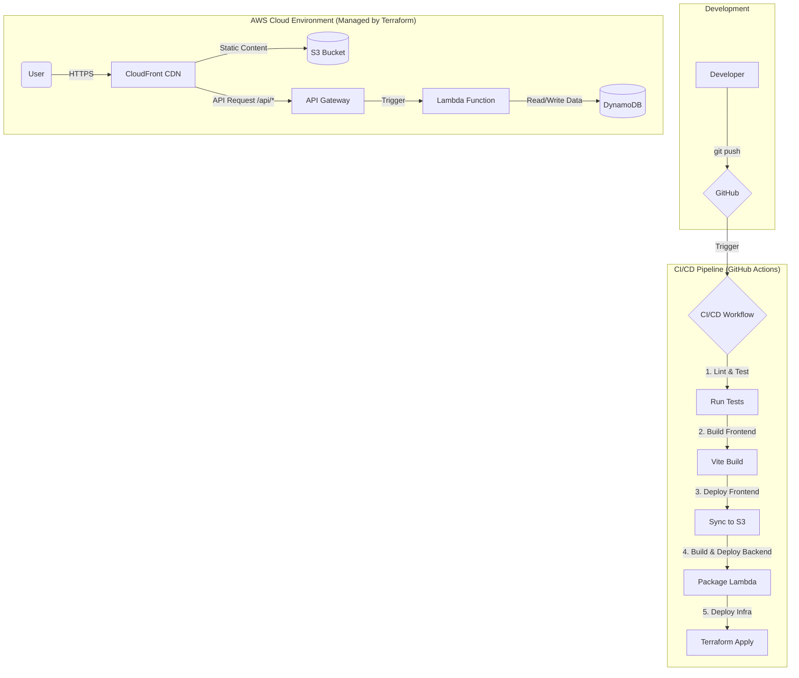

# Echo Tree: A Modern Web Application Showcase

> 🌐 Language versions: [English](README.md) · [繁體中文](README.zh-tw.md) · [日本語](README.ja.md)

Welcome to the Echo Tree project! This is more than just a 3D interactive application; it's a comprehensive showcase of modern cloud architecture, DevOps principles, and automated workflows.

This document serves as both an explanation of the architecture and a step-by-step guide to deploying the entire stack from scratch.

## 🏛️ Architecture Overview

This project is built upon the **[12-Factor App](https://12factor.net/)** methodology, utilizing a **Serverless-first** approach on AWS. The entire infrastructure is managed as code (IaC) and deployed automatically via a CI/CD pipeline.

### Core Principles
- **Infrastructure as Code (IaC)**: All cloud resources (database, servers, CDN) are defined in code using Terraform. No manual clicking in the AWS console.
- **CI/CD Automation**: Every `git push` to the `main` branch automatically triggers a pipeline that tests, builds, and deploys the entire application.
- **Serverless Compute**: We use AWS Lambda for our backend, meaning we have no servers to manage, and it scales automatically with demand.
- **Scalable & Cost-Effective**: The architecture is designed to handle high traffic while remaining extremely cost-effective (pay-per-use).

### Technology Stack

| Domain | Technology | Purpose |
| :--- | :--- | :--- |
| **Cloud Platform** | AWS | The foundation for all our services. |
| **Frontend** | React, Three.js, Vite | For a rich, interactive 3D user experience. |
| **Frontend Deploy** | S3 + CloudFront | Globally distributed, fast, and secure static site hosting. |
| **Backend API** | API Gateway + Lambda | Fully managed, scalable, serverless API. |
| **Database** | DynamoDB | High-performance, scalable NoSQL database. |
| **IaC** | Terraform | Defining and managing our cloud infrastructure as code. |
| **CI/CD** | GitHub Actions | Automating the entire build and deployment process. |

### Architecture Diagram



---

## 🚀 Deployment Guide: A Detailed Step-by-Step Walkthrough

This guide is designed for everyone, especially junior developers, to understand and execute the deployment of this project. We'll go through each step in detail.

### Phase 3: Connecting the Frontend and Going Live

#### Step 3.1: Configure the Frontend Environment

1.  Move into the frontend folder:
    ```bash
    cd app
    ```
2.  Copy the sample environment file and create your local `.env`:
    ```bash
    cp .env.example .env
    ```
3.  Edit `.env` and set `VITE_API_BASE_URL` to the base URL from your Terraform output (no trailing slash). Example:
    ```
    VITE_API_BASE_URL=https://xxxx.execute-api.us-east-1.amazonaws.com/v1
    ```
    The React app automatically appends `/cards`, so you never need to hardcode the endpoint.
4.  Keep `.env` out of Git (it is already ignored) and point teammates to `.env.example` whenever they need to configure their own machines.

#### Step 3.2: Test Locally and Push

1.  (Recommended) Verify the connection locally from the `app` directory:
    ```bash
    npm install
    npm run dev
    ```
    When you're done testing, stop the dev server with `Ctrl+C` and return to the repo root: `cd ..`.
2.  Commit any pending work (docs, UI tweaks, etc.) and push to `main` to trigger the pipeline:
    ```bash
    git add .
    git commit -m "feat: hook up API via env"
    git push origin main
    ```
3.  **Open the "Actions" tab** in GitHub to watch the workflow. It will:
    *   Build the React app and upload it to S3.
    *   Package and deploy the Lambda API.
    *   Run `terraform apply` for infrastructure drift.
    *   Invalidate the CloudFront cache.
4.  After the run succeeds (green checkmark), open the `cloudfront_domain_name` from your Terraform outputs and confirm the cards load from the live API.

**Congratulations! Your application is now live, fully automated, and running on a modern serverless stack.** Any future `git push` to the `main` branch will automatically update it.

1.  In **IAM**, go to `Roles` on the left menu and click `Create role`.
2.  For **Trusted entity type**, select `Web identity`.
3.  Under "Web identity", choose the `token.actions.githubusercontent.com` provider you just created.
4.  For **Audience**, choose `sts.amazonaws.com`.
5.  For **GitHub organization/repository**, enter your details.
    *   **Organization**: Your GitHub username.
    *   **Repository**: `echo-tree`
    *   **Branch (optional but recommended)**: `main`
6.  Click `Next`.
7.  On the "Add permissions" page, check the box for `AdministratorAccess`.
8.  Click `Next`.
9.  Give the role a name, like `github-actions-echo-tree-role`.
10. Review the details and click `Create role`.
11. **ACTION**: Click on the role you just created and **copy its ARN**. It will look like `arn:aws:iam::123456789012:role/github-actions-echo-tree-role`.

#### Step 2.3: Configure GitHub Secrets

Now, let's give our GitHub repository the information it needs to use this role.

1.  **In your forked GitHub repository**, go to `Settings > Secrets and variables > Actions`.
2.  Switch to the `Secrets` tab and click `New repository secret` for each of the following:
    *   `AWS_IAM_ROLE_ARN`: Paste the **Role ARN** you copied in the previous step.
    *   `S3_BUCKET_NAME`: Paste the `s3_bucket_name` value from your Terraform output.
    *   `CLOUDFRONT_DISTRIBUTION_ID`: Paste the `cloudfront_distribution_id` from your Terraform output.

---

### Phase 3: Connecting the Frontend and Going Live

The final step is to tell our React app where to find its API.

#### Step 3.1: Update the Frontend Code

1.  In your code editor, open the file `app/src/App.jsx`.
2.  Find the `useEffect` hook that currently loads static `seedCardsData`. We need to replace this with a real API call.
3.  Use the `api_gateway_invoke_url` from your Terraform output to construct the full API endpoint URL. It should look like `https://xxxx.execute-api.us-east-1.amazonaws.com/v1/cards`.

    ```javascript
    // In app/src/App.jsx

    // ... inside the App component ...

    const API_URL = "PASTE_YOUR_API_GATEWAY_INVOKE_URL_HERE/cards";

    // Replace the existing useEffect that loads seedCardsData
    useEffect(() => {
      const fetchAllCards = async () => {
        try {
          const response = await fetch(API_URL);
          if (!response.ok) {
            throw new Error(`HTTP error! status: ${response.status}`);
          }
          const fetchedCards = await response.json();
          // Process fetched cards (e.g., create THREE.Color objects)
          const processedCards = fetchedCards.map(card => ({
            ...card,
            position: [
              (Math.random() - 0.5) * 20,
              (Math.random() - 0.5) * 10,
              (Math.random() - 0.5) * 15,
            ],
            colorObj: new THREE.Color(card.color),
          }));
          setUserCards(processedCards);
        } catch (error) {
          console.error("Failed to fetch cards:", error);
          // Keep showing seed data as a fallback
        }
      };

      fetchAllCards();
    }, []);

    // Update the handleCardSubmit function
    const handleCardSubmit = useCallback(async (newCard) => {
      try {
        const response = await fetch(API_URL, {
          method: 'POST',
          headers: { 'Content-Type': 'application/json' },
          body: JSON.stringify(newCard),
        });
        if (!response.ok) throw new Error('Failed to submit card');
        
        const savedCard = await response.json();
        // Add the new card to the scene
        const cardWithPosition = {
          ...savedCard,
          position: [
            (Math.random() - 0.5) * 20,
            (Math.random() - 0.5) * 10,
            (Math.random() - 0.5) * 15 - 2,
          ],
          colorObj: new THREE.Color(savedCard.color),
        };
        setUserCards(prev => [...prev, cardWithPosition]);
        setMeteorTrigger(prev => prev + 1);
      } catch (error) {
        console.error("Submit error:", error);
      }
    }, []);

    // ... rest of the component
    ```

#### Step 3.2: The Final Push

This is the moment of truth.

1.  Save the changes to `app/src/App.jsx`.
2.  In your terminal, commit and push the changes:
    ```bash
    git add app/src/App.jsx
    git commit -m "feat: connect frontend to live API"
    git push origin main
    ```
3.  **Go to the "Actions" tab** in your GitHub repository. You'll see a new workflow running.
4.  Click on it to watch the magic happen. The pipeline will:
    *   Build your React app.
    *   Upload it to S3.
    *   Package your API code.
    *   Run `terraform apply` to deploy the API code.
    *   Invalidate the CloudFront cache.
5.  Once the pipeline succeeds (shows a green checkmark), open the `cloudfront_domain_name` in your browser.

**Congratulations! Your application is now live, fully automated, and running on a modern serverless stack.** Any future `git push` to the `main` branch will automatically update it.

