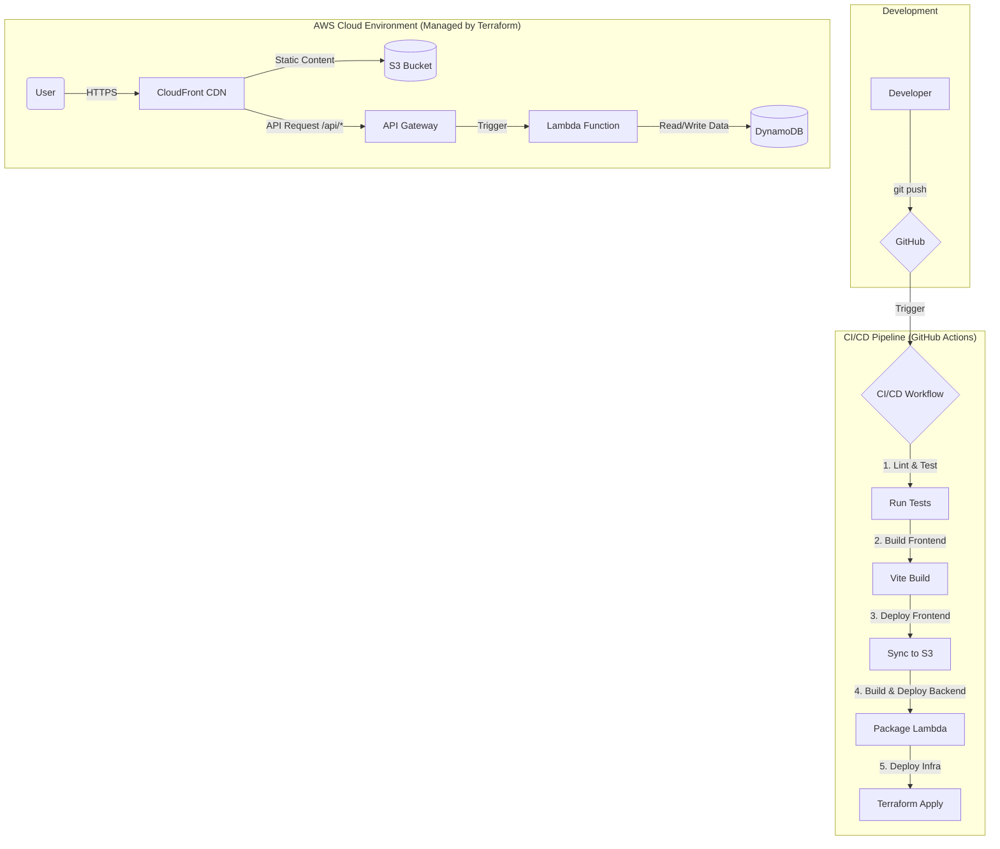

# Echo Tree: A Modern Web Application Showcase

Welcome to the Echo Tree project! This is more than just a 3D interactive application; it's a comprehensive showcase of modern cloud architecture, DevOps principles, and automated workflows.

This document serves as both an explanation of the architecture and a step-by-step guide to deploying the entire stack from scratch.

## 🏛️ Architecture Overview

This project is built upon the **[12-Factor App](https://12factor.net/)** methodology, utilizing a **Serverless-first** approach on AWS. The entire infrastructure is managed as code (IaC) and deployed automatically via a CI/CD pipeline.

### Core Principles
- **Infrastructure as Code (IaC)**: All cloud resources (database, servers, CDN) are defined in code using Terraform. No manual clicking in the AWS console.
- **CI/CD Automation**: Every `git push` to the `main` branch automatically triggers a pipeline that tests, builds, and deploys the entire application.
- **Serverless Compute**: We use AWS Lambda for our backend, meaning we have no servers to manage, and it scales automatically with demand.
- **Scalable & Cost-Effective**: The architecture is designed to handle high traffic while remaining extremely cost-effective (pay-per-use).

### Technology Stack

| Domain | Technology | Purpose |
| :--- | :--- | :--- |
| **Cloud Platform** | AWS | The foundation for all our services. |
| **Frontend** | React, Three.js, Vite | For a rich, interactive 3D user experience. |
| **Frontend Deploy** | S3 + CloudFront | Globally distributed, fast, and secure static site hosting. |
| **Backend API** | API Gateway + Lambda | Fully managed, scalable, serverless API. |
| **Database** | DynamoDB | High-performance, scalable NoSQL database. |
| **IaC** | Terraform | Defining and managing our cloud infrastructure as code. |
| **CI/CD** | GitHub Actions | Automating the entire build and deployment process. |

### Architecture Diagram



---

## 🚀 Deployment Guide

Follow these steps to deploy your own version of the Echo Tree project.

### Prerequisites

1.  **AWS Account**: You need an AWS account with administrative privileges.
2.  **GitHub Account**: To fork the repository and use GitHub Actions.
3.  **Tools**:
    *   [Git](https://git-scm.com/)
    *   [Node.js](https://nodejs.org/) (v18 or later)
    *   [Terraform CLI](https://learn.hashicorp.com/tutorials/terraform/install-cli) (v1.5.0 or later)

### Step 1: Fork & Clone the Repository

1.  **Fork** this repository to your own GitHub account.
2.  **Clone** your forked repository to your local machine:
    ```bash
    git clone https://github.com/YOUR_USERNAME/echo-tree.git
    cd echo-tree
    ```

### Step 2: AWS IAM User Setup (For Initial Deployment)

To run Terraform locally for the first time, you need an IAM user with credentials.

1.  Go to the **IAM service** in your AWS Console.
2.  Create a new user.
3.  Attach the `AdministratorAccess` policy directly to the user. (Note: For production, you'd use more granular permissions).
4.  In the "Security credentials" tab, create an access key.
5.  **Save the `Access key ID` and `Secret access key`**.
6.  Configure your local AWS CLI with these credentials:
    ```bash
    aws configure
    # Enter your Access Key ID, Secret Access Key, and default region (e.g., us-east-1)
    ```

### Step 3: Initial Terraform Deployment (Manual)

This one-time manual deployment creates the resources needed for the CI/CD pipeline to take over.

1.  Navigate to the Terraform directory:
    ```bash
    cd terraform
    ```
2.  Initialize Terraform. This downloads the necessary AWS provider.
    ```bash
    terraform init
    ```
3.  Apply the configuration. This will prompt you to confirm the resources to be created.
    ```bash
    terraform apply
    ```
4.  Type `yes` and press Enter. Terraform will now create all the AWS resources defined in the `.tf` files.
5.  After a few minutes, the process will complete. **Copy the output values** like `cloudfront_domain_name`, `s3_bucket_name`, and `api_gateway_invoke_url`. You will need them soon.

### Step 4: GitHub & AWS OIDC Integration

Now, we'll set up a secure, passwordless connection between GitHub Actions and AWS using OIDC.

1.  **In AWS IAM**:
    *   Go to `Identity providers` and add a new `OpenID Connect` provider.
    *   For "Provider URL", enter `https://token.actions.githubusercontent.com`.
    *   For "Audience", enter `sts.amazonaws.com`.
2.  **Create the IAM Role for GitHub Actions**:
    *   Go to `Roles` and create a new role.
    *   For "Trusted entity type", select `Web identity`.
    *   Choose the identity provider you just created.
    *   For "Audience", select `sts.amazonaws.com`.
    *   For "GitHub organization/repository", enter your repository details (e.g., `YOUR_USERNAME/echo-tree`).
    *   Attach the `AdministratorAccess` policy.
    *   Give the role a name (e.g., `github-actions-echo-tree-role`) and create it.
    *   **Copy the ARN of this new role.**

3.  **In Your GitHub Repository**:
    *   Go to `Settings > Secrets and variables > Actions`.
    *   Create the following **repository secrets**:
        *   `AWS_IAM_ROLE_ARN`: The ARN of the IAM role you just created.
        *   `S3_BUCKET_NAME`: The `s3_bucket_name` value from the `terraform apply` output.
        *   `CLOUDFRONT_DISTRIBUTION_ID`: The `cloudfront_distribution_id` from the Terraform output.

### Step 5: Connect Frontend to Backend

1.  Open the file `app/src/App.jsx`.
2.  Find the `useEffect` hook that fetches card data.
3.  Replace the static data fetching with a `fetch` call to your new API. Use the `api_gateway_invoke_url` from the Terraform output.

    ```javascript
    // Example of what to change in app/src/App.jsx

    // Find this function and replace its content
    const fetchAllCards = useCallback(async () => {
      try {
        // The URL from your terraform output
        const response = await fetch("YOUR_API_GATEWAY_INVOKE_URL/cards"); 
        const data = await response.json();
        
        // Logic to process and set cards...
      } catch (error) {
        console.error("Failed to fetch cards:", error);
      }
    }, []);
    ```
    *Do the same for the `handleCardSubmit` function, changing it to `POST` data to the same URL.*

### Step 6: Trigger the CI/CD Pipeline!

You are all set! Now for the magic.

1.  Commit and push the changes you made to `App.jsx`:
    ```bash
    git add app/src/App.jsx
    git commit -m "feat: connect frontend to live API"
    git push origin main
    ```
2.  Go to the **"Actions"** tab in your GitHub repository.
3.  You will see a new workflow running. Click on it to watch the logs in real-time as it builds, tests, and deploys your application.
4.  Once the pipeline is complete, open the `cloudfront_domain_name` in your browser. Your Echo Tree application is now live!

From now on, every push to the `main` branch will automatically update your live application. Welcome to the world of modern DevOps!
