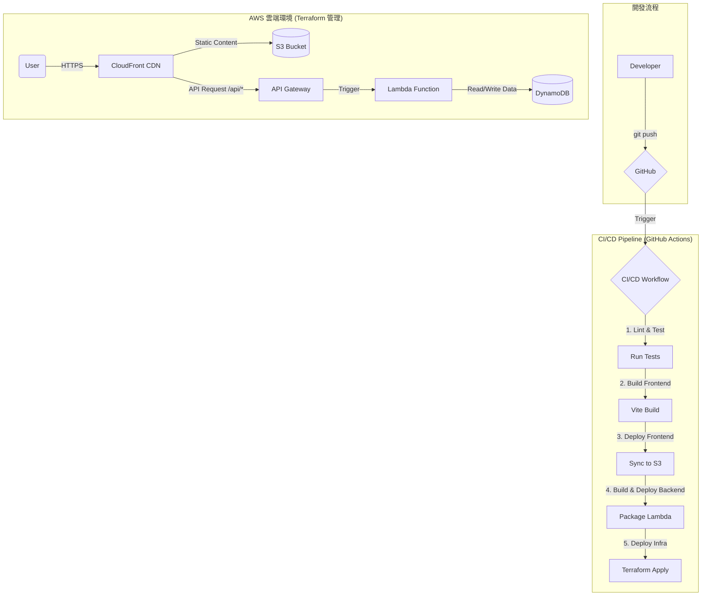

# Echo Tree：現代雲端應用示範

歡迎來到 Echo Tree 專案！這不只是一個 3D 互動體驗，而是完整展演現代化雲端架構、DevOps 精神與自動化部署流程的示範。本文件將以台灣繁體中文詳細解說整體架構，並用循序漸進的方式教你從零開始完成部署。

## 🏛️ 架構概覽

專案遵循 **12-Factor App** 原則，採用 **Serverless-First** 的 AWS 架構。所有基礎設施都透過 Terraform 以程式碼管理，並由 GitHub Actions 自動部署。

### 核心理念
- **Infrastructure as Code**：資料庫、API、CDN 全以 Terraform 定義，不需要進 AWS Console 點選。
- **CI/CD 自動化**：每次 `git push main` 會自動觸發建置、測試、部署。
- **Serverless 運算**：後端使用 Lambda，免維護伺服器即可自動擴充。
- **高延展性、低成本**：採用按需付費的雲端託管，沒有流量時幾乎不產生費用。

### 技術堆疊

| 範疇 | 技術 | 用途 |
| :--- | :--- | :--- |
| 雲端平台 | AWS | 所有服務的承載平台 |
| 前端 | React、Three.js、Vite | 呈現沉浸式 3D 體驗 |
| 前端部署 | S3 + CloudFront | 全球 CDN 加速、HTTPS 加密 |
| 後端 API | API Gateway + Lambda | 無伺服器、可水平擴充的 REST API |
| 資料庫 | DynamoDB | 高效能 NoSQL，與 Lambda 無縫整合 |
| IaC | Terraform | 以程式碼定義所有雲端資源 |
| CI/CD | GitHub Actions | 自動化建置、測試、部署流程 |

### 架構圖



---

## 🚀 部署教學：Step-by-Step

以下教學特別為 0-2 年經驗的開發者設計，協助你一步步部署屬於自己的 Echo Tree。

### 階段一：本機環境與首次手動部署

#### Step 1.1 取得程式碼
1. 造訪 GitHub 頁面並按下 **Fork**，將專案複製到自己的帳號。
2. 打開終端機，輸入：
   ```bash
   git clone https://github.com/YOUR_USERNAME/echo-tree.git
   cd echo-tree
   ```

#### Step 1.2 安裝必要工具
請依序安裝：
- [Git](https://git-scm.com/book/en/v2/Getting-Started-Installing-Git)
- [Node.js v18+](https://nodejs.org/en/download/)
- [Terraform CLI v1.5+](https://learn.hashicorp.com/tutorials/terraform/install-cli)
- [AWS CLI](https://docs.aws.amazon.com/cli/latest/userguide/getting-started-install.html)

#### Step 1.3 設定 AWS 認證
1. 登入 [AWS Console](https://aws.amazon.com/console/)，搜尋並進入 **IAM** 服務。
2. 建立新使用者（例如 `echo-tree-local-admin`），並賦予 `AdministratorAccess`。
3. 進入該使用者的 **Security credentials** 分頁，建立 Access Key，並立即保存 `Access key ID` 與 `Secret access key`。
4. 在終端機執行：
   ```bash
   aws configure
   ```
   依序輸入剛剛取得的 Key 與預設區域（例如 `us-east-1`）。

#### Step 1.4 執行 Terraform
1. 進入 Terraform 目錄：
   ```bash
   cd terraform
   ```
2. 初始化：
   ```bash
   terraform init
   ```
3. 建立資源：
   ```bash
   terraform apply
   ```
4. 確認 Plan 後輸入 `yes`，等待所有 AWS 資源建立完成。
5. **重要：將輸出 (Outputs) 中的 `cloudfront_domain_name`、`s3_bucket_name`、`api_gateway_invoke_url` 複製下來**，稍後會用到。

---

### 階段二：設定 GitHub Actions 與 AWS 的安全連線（OIDC）

#### Step 2.1 建立 OpenID Connect Provider
1. 回到 IAM，於左側選單點選 **Identity providers** → **Add provider**。
2. 選擇 `OpenID Connect`。
3. Provider URL 輸入 `https://token.actions.githubusercontent.com`，Audience 輸入 `sts.amazonaws.com`。

#### Step 2.2 建立 GitHub 專屬 IAM Role
1. 在 IAM → **Roles** → **Create role**。
2. 選擇 `Web identity`，挑選剛建立的 OIDC Provider，Audience 指定 `sts.amazonaws.com`。
3. 指定 GitHub 組織／儲存庫（例如 `YOUR_USERNAME/echo-tree`），可加上分支 `main`。
4. 賦予 `AdministratorAccess` 權限。
5. 命名（如 `github-actions-echo-tree-role`），建立後 **複製 Role ARN**。

#### Step 2.3 設定 GitHub Secrets
1. 到 GitHub 專案 → **Settings → Secrets and variables → Actions**。
2. 新增三個 Secrets：
   - `AWS_IAM_ROLE_ARN`：貼上剛才的 Role ARN。
   - `S3_BUCKET_NAME`：貼上 Terraform 輸出的 S3 Bucket 名稱。
   - `CLOUDFRONT_DISTRIBUTION_ID`：貼上 CloudFront Distribution ID。

---

### 階段三：串接前端並觸發 CI/CD

#### Step 3.1 修改前端程式碼
1. 打開 `app/src/App.jsx`。
2. 將原本載入 `seedCardsData` 的 `useEffect` 改成呼叫 API。
3. 使用 Terraform 輸出的 `api_gateway_invoke_url`，組成 `https://xxxxx.execute-api.us-east-1.amazonaws.com/v1/cards`。

```javascript
const API_URL = "PASTE_YOUR_API_GATEWAY_INVOKE_URL_HERE/cards";

useEffect(() => {
  const fetchAllCards = async () => {
    try {
      const response = await fetch(API_URL);
      if (!response.ok) throw new Error(`HTTP ${response.status}`);
      const fetchedCards = await response.json();
      const processed = fetchedCards.map(card => ({
        ...card,
        position: [
          (Math.random() - 0.5) * 20,
          (Math.random() - 0.5) * 10,
          (Math.random() - 0.5) * 15,
        ],
        colorObj: new THREE.Color(card.color),
      }));
      setUserCards(processed);
    } catch (error) {
      console.error('Failed to fetch cards:', error);
    }
  };
  fetchAllCards();
}, []);
```

同時將 `handleCardSubmit` 改成對 `API_URL` 發送 `POST`，並把回傳結果加入場景。

#### Step 3.2 Push 並觀看 CI/CD
1. 在終端機回到專案根目錄：
   ```bash
   cd ..
   git add app/src/App.jsx
   git commit -m "feat: connect frontend to live API"
   git push origin main
   ```
2. 到 GitHub → **Actions**，可以看到 Workflow 自動執行：
   - 建置前端並同步到 S3。
   - 打包後端並部署 Lambda。
   - Terraform 更新基礎設施。
   - CloudFront 快取失效，立即提供最新版本。
3. Workflow 成功 (綠勾) 後，打開 `cloudfront_domain_name`，即可看到正式上線的 Echo Tree！

---

恭喜！現在起，每一次 `git push main` 都會自動更新線上環境。這就是現代 DevOps 的威力。祝你在 All Hands 會議上展示順利，也歡迎同事們照著本文件動手實作！
