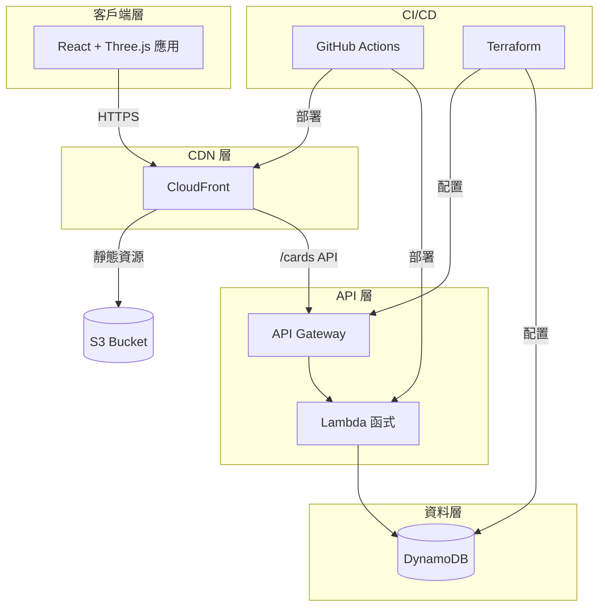

<div align="center">

# ✨ Echo Tree

### 將團隊記憶化為星空中的璀璨星光

[](https://opensource.org/licenses/MIT)
[](https://github.com/erictung1999/echo-tree/stargazers)
[](https://github.com/erictung1999/echo-tree/network/members)
[](https://github.com/erictung1999/echo-tree/issues)

[English](README.md) · **[繁體中文](README.zh-tw.md)** · [日本語](README.ja.md)

<br />


<br />

*沉浸式 3D 體驗，讓每一段記憶都成為團隊宇宙中閃爍的星光。*

<br />

[功能特色](#-功能特色) · [快速開始](#-快速開始) · [架構設計](#%EF%B8%8F-架構設計) · [部署指南](#-部署指南) · [貢獻指南](#-貢獻指南)

</div>

---

## 🎯 什麼是 Echo Tree？

Echo Tree 是一款**互動式 3D 記憶收集應用**，團隊成員可以在虛擬星空中建立、分享和探索記憶卡片。適用場景：

- 🎤 **All-Hands 會議** — 即時收集團隊的感謝與亮點時刻
- 🎉 **慶祝與里程碑** — 收集生日祝福、週年紀念回憶
- 📅 **年終回顧** — 一起視覺化這一年的成就
- 🏆 **黑客松與活動** — 透過 QR Code 建立共享記憶空間

除了絕佳的使用體驗，Echo Tree 也是**現代雲端架構的最佳示範**，展示了 Serverless 開發、Infrastructure as Code 和 CI/CD 自動化的實務應用。

---

## ⭐ 功能特色

### 🌌 3D 互動星空

在記憶的宇宙中自由飛翔，享受流暢的 3D 視覺體驗。使用 **Three.js** 和 **React Three Fiber** 構建，透過 **InstancedMesh** 技術實現單次繪製呼叫渲染數百張卡片的高效能表現。

### ✍️ AI 智慧顏色推薦記憶卡片

建立精美的記憶卡片，可選擇啟用 **AI 情緒分析**，根據文字內容自動推薦對應顏色。採用 **Lumina Spark** 模型，透過 `transformers.js` 完全在瀏覽器端執行，使用 Web Worker 確保不阻塞主執行緒。

### 🎬 電影級 AutoPilot 導航

體驗好萊塢級的攝影運鏡：
- **Dolly Zoom** — 聚焦效果，帶你深入每段記憶
- **Speed Ramping** — 動態變速，營造戲劇張力
- **Crane & Orbit Shots** — 專業攝影技法
- **智慧卡片選擇** — 加權演算法避免重複瀏覽

### 📺 大螢幕展示模式

完美適合活動現場大螢幕展示：
- **自動輪播** — 9 秒間隔切換，附進度指示器
- **多卡流動模式** — 卡片優雅地浮現與淡出
- **QR Code 整合** — 與會者掃碼即可即時新增記憶
- **鍵盤快捷鍵** — ← → 切換、空白鍵/P 暫停、ESC 離開

### 📱 跨裝置完美體驗

在任何裝置上都能完美運作：
- **陀螺儀控制** — 在手機上傾斜即可導航星空
- **觸覺反饋** — 互動時感受細微的震動回饋
- **滑鼠視差效果** — 桌面端游標移動產生微妙動態
- **尊重 `prefers-reduced-motion`** — 無障礙設計優先

### 🎄 隱藏彩蛋驚喜

輸入 **Konami Code**（↑↑↓↓←→←→BA）解鎖魔幻聖誕驚喜：
- ❄️ 真實物理效果的飄雪
- 🌲 精心裝飾的 3D 聖誕樹
- 🔥 溫馨的動態壁爐
- 🌌 天空中的極光
- 🍪 跳舞的薑餅人群

---

## 🚀 快速開始

### 本機體驗（僅前端）

30 秒內體驗 3D 星空：

```bash
git clone https://github.com/erictung1999/echo-tree.git
cd echo-tree/app
npm install
npm run dev
```

開啟 [http://localhost:5173](http://localhost:5173) 開始建立記憶！

> 💡 **提示**：沒有後端時，卡片僅儲存在 localStorage。如需雲端永久保存，請參閱[部署指南](#-部署指南)。

### 完整開發環境

搭配完整後端執行：

```bash
# 1. 設定前端
cd app
cp .env.example .env
# 編輯 .env 填入 API 端點
npm install
npm run dev

# 2. 部署後端（需要 AWS CLI 和 Terraform）
cd ../terraform
terraform init
terraform apply
```

---

## 🏛️ 架構設計

Echo Tree 遵循 **[12-Factor App](https://12factor.net/)** 方法論，採用 **Serverless-first** 架構。

### 系統概覽



### 技術棧

<table>
<tr>
<td valign="top" width="33%">

#### 前端


- **React Three Fiber** 宣告式 3D
- **Drei** Three.js 工具組件
- **Transformers.js** 瀏覽器端 AI

</td>
<td valign="top" width="33%">

#### 後端


- **Express.js** 搭配 serverless-http
- **UUID** 卡片唯一識別碼
- **GSI** 群組事件查詢索引

</td>
<td valign="top" width="33%">

#### 基礎設施


- **S3** 靜態網站託管
- **OIDC** 安全 AWS 認證
- **IaC** — 告別手動點擊！

</td>
</tr>
</table>

### 關鍵設計決策

| 決策 | 理由 |
|------|------|
| **InstancedMesh 渲染卡片** | 單次繪製呼叫渲染 100+ 張卡片，維持 60fps 效能 |
| **Web Worker 執行 AI** | 非阻塞情緒分析，保持 UI 流暢回應 |
| **DynamoDB GSI** | 透過 `eventCode` 高效查詢群組/活動卡片 |
| **環境變數驅動設定** | 零硬編碼 URL，跨開發/測試/正式環境通用 |
| **OIDC 認證 CI/CD** | GitHub Secrets 中無需長期 AWS 憑證 |

> 📖 完整架構決策說明請參閱 [ADR.md](ADR.md)

---

## 🚢 部署指南

### 前置需求

- AWS 帳號並具備適當權限
- Terraform >= 1.5.0
- Node.js >= 22
- GitHub 儲存庫（用於 CI/CD）

### 步驟一：基礎設施設定

```bash
cd terraform
terraform init
terraform apply
```

記下輸出值 — 你會需要 `api_gateway_invoke_url`、`s3_bucket_name` 和 `cloudfront_distribution_id`。

### 步驟二：設定 GitHub Secrets

在儲存庫設定中新增以下 Secrets：

| Secret | 值 |
|--------|------|
| `AWS_IAM_ROLE_ARN` | 你的 OIDC Role ARN |
| `S3_BUCKET_NAME` | Terraform 輸出值 |
| `CLOUDFRONT_DISTRIBUTION_ID` | Terraform 輸出值 |

### 步驟三：設定前端

```bash
cd app
cp .env.example .env
# 編輯 .env，填入 Terraform 輸出的 VITE_API_BASE_URL
```

### 步驟四：部署

```bash
git add .
git commit -m "Configure deployment"
git push origin main
```

GitHub Actions 會自動：
1. ✅ 建構 React 應用
2. ✅ 同步至 S3
3. ✅ 部署 Lambda 函式
4. ✅ 清除 CloudFront 快取

你的應用已上線！🎉

---

## 🗺️ 開發路線圖

- [ ] **WebSocket 即時同步** — 即時看到新卡片出現
- [ ] **多語言 UI** — 不只是文件，介面也支援多語言
- [ ] **更多彩蛋** — 季節主題（萬聖節、新年）
- [ ] **卡片反應** — 讓觀看者對記憶送出 ❤️
- [ ] **匯出功能** — 將星空下載為影片

---

## 🤝 貢獻指南

我們歡迎各種貢獻！無論是：

- 🐛 Bug 修復
- ✨ 新功能
- 📝 文件改善
- 🎨 UI/UX 優化

### 如何開始

1. Fork 這個儲存庫
2. 建立功能分支（`git checkout -b feature/amazing-feature`）
3. 提交變更（`git commit -m 'Add amazing feature'`）
4. 推送分支（`git push origin feature/amazing-feature`）
5. 開啟 Pull Request

---

## 📄 授權條款

本專案採用 MIT 授權條款 — 詳見 [LICENSE](LICENSE) 檔案。

---

<div align="center">

### ⭐ 如果你覺得 Echo Tree 有幫助，請給這個專案一顆星！

這能幫助更多人發現這個專案，也是我們持續改進的動力。

<br />

**由 Echo Tree 團隊用 ❤️ 打造**

</div>
